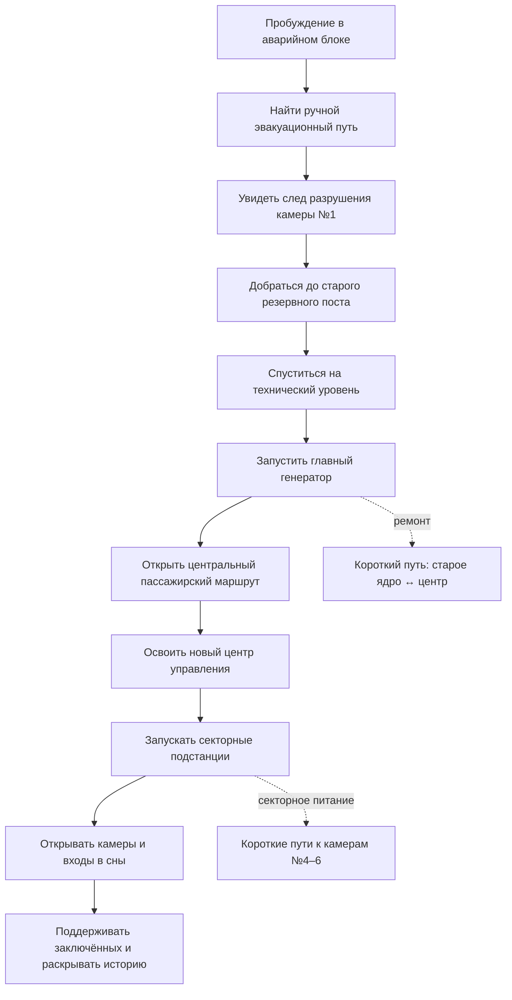
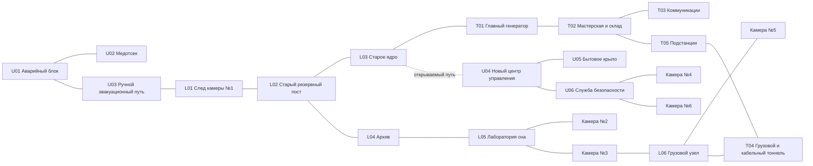

# Карта комплекса v2

## Назначение и границы

Новая карта создаётся с нуля по `docs/world/` и не использует геометрию старой сцены. Она должна работать как постепенно раскрывающийся хаб: сначала тесный аварийный маршрут, затем старое ядро и энергетика, после чего — центральный узел и разнесённые камеры.

Карта рассчитана на вид от первого лица и обычное перемещение: ходьба, бег, прыжок, будущие приседание/ползание и простые лестницы. Точный сюжетный порядок после запуска генератора остаётся открытым, поэтому поздние блокировки представлены архитектурой, дверями и завалами без окончательной логики допусков.

## Реестр контекста

| Класс | Положение | Источник |
|---|---|---|
| Известно | Комплекс подземный, повреждённый, строился очередями | Библия мира |
| Зафиксировано | Два основных этажа и технический уровень | Библия мира |
| Зафиксировано | Шесть изолированных камер; №1–2 технологически старше №3–6 | Библия мира |
| Зафиксировано | Старт в аварийном блоке, затем ручной путь к старому посту и генератору | Библия мира |
| Зафиксировано | Старую карту нельзя удалять или изменять | Запрос и Issue #24 |
| Выведено | Модульная сетка 5 м подходит существующим полу, стенам и потолкам | Размеры сцен `objects/floor.tscn`, `wall.tscn`, `celling.tscn` |
| Допущение | Боузер временно размещён в камере №3, Херобрин — в №4 | Точное соответствие в каноне открыто; замена не меняет топологию |
| Допущение | Поздние камеры №5–6 остаются без заключённых, но имеют инфраструктуру модуля | Состав объектов №5–6 не определён |
| Неизвестно | Окончательная последовательность подстанций и допусков | Открытый вопрос библии |

## Условия приёмки карты

1. От стартовой капсулы существует непрерывный путь к старому резервному посту.
2. От старого поста существует непрерывный путь к главному генератору.
3. После условного восстановления питания доступны центральный узел и минимум две полноценные камеры сна.
4. Все шесть камер существуют физически, но не видны из одного узла.
5. Камеры №1–2 нельзя спутать со стандартизированными модулями №3–6.
6. Каждый тупик имеет функцию: сюжетный след, оборудование, ресурсная зона или будущий вход в сон.
7. Основные помещения соединены логичными пассажирскими, техническими или грузовыми маршрутами.
8. Вертикальные переходы имеют обратный маршрут; сюжетных одноразовых падений нет.

## Миссионный граф

## Маршрутный граф

### Назначение циклов

- `старый пост → архив → лаборатория → старое ядро` становится исследовательским кольцом после открытия гермодвери;
- `новый центр → безопасность → поздние камеры → грузовой узел → технический уровень` даёт длинный сервисный обход и будущий короткий возврат;
- центральный переход между этажами сокращает первоначальный путь в несколько раз и превращает аварийный маршрут в сюжетный обход;
- грузовой маршрут шире пассажирского, но перекрыт усиленными воротами и не служит главным стартовым путём.

## Поэтажная структура

Высота между уровнями — 12 м. Геометрия помещений привязана к сетке 5 м; ширина основного дверного проёма — 5 м. Координаты ниже служат стабильной основой реализации, но не являются каноном мира.

### Верхний этаж, Y = 12

| ID | Зона | Роль |
|---|---|---|
| U01 | Аварийный блок сна персонала | Старт, безопасное обучение, неизвестная судьба персонала |
| U02 | Медотсек | Логичная соседняя функция аварийного блока |
| U03 | Ручной эвакуационный коридор | Единственный стартовый выход, механические двери |
| U04 | Новый центр управления | Главный поздний ориентир и распределительный узел |
| U05 | Столовая, раздевалки и комната отдыха | Разрядка и история персонала без жилого корпуса |
| U06 | Главная служба безопасности | Порог к поздним секторам |
| U07 | Новая серверная | Информационный и энергетический узел центра |
| C04 | Камера №4 | Первый серийный автономный модуль |
| C06 | Камера №6 | Самая новая удалённая пристройка |
| U08 | Периферийный грузовой узел | Недоступный путь к поверхности |

### Нижний этаж, Y = 0

| ID | Зона | Роль |
|---|---|---|
| C01 | Камера №1 | Разрушенная механическая клетка и главный след аварии |
| L01 | Старый эвакуационный коридор | Показывает внешний шлюз C01, не объясняя его |
| L02 | Старый резервный пост | Первая цель и выдача задачи генератора |
| L03 | Старое ядро | Грубый центр ранней инфраструктуры |
| L04 | Архив | История строительства и объектов |
| L05 | Ранняя лаборатория сна | Связь камер №2 и №3, развитие технологии |
| C02 | Камера №2 | Механика и химический сон, без полноценного входа |
| C03 | Камера №3 | Экспериментальная полноценная капсула |
| C05 | Камера №5 | Удалённая поздняя пристройка |
| L06 | Грузовой узел | Тяжёлая логистика камер №3–6 |

### Технический уровень, Y = -12

| ID | Зона | Роль |
|---|---|---|
| T01 | Главный генератор | Вторая обязательная цель и энергетический ориентир |
| T02 | Мастерская и склад | Ремонтная логика рядом с генератором и грузовым путём |
| T03 | Вентиляция и водоподготовка | Поддержание аварийного блока и комплекса |
| T04 | Подстанции | Поздние секторные ворота |
| T05 | Кабельные тоннели | Скрытые обходы и будущие короткие пути |
| T06 | Нижний грузовой узел | Связь с удалёнными камерами и лифтом |

## Навигация и визуальный язык

- Верхний этаж: более ровная поздняя архитектура, синие указатели, отдельные красные аварийные акценты.
- Нижний этаж: грубый бетон, старые номера, больше завалов и разновременных усилений.
- Технический уровень: тёплые предупреждающие акценты, трубы, генераторы, стеллажи и узкие сервисные участки.
- Новый центр управления, пролом C01 и главный генератор являются тремя крупными ориентирами.
- Указатели называют локальную зону, но не показывают полный план и количество камер.
- Светильники размещаются по оси маршрутов; терминалы и аварийные лампы не ставятся на полотна дверей.

## Риски и будущая проверка

- Приседание, ползание и вертикальные лестницы ещё не реализованы в контроллере игрока, поэтому обязательный маршрут использует ходьбу и пологие пандусы.
- Логика питания и допусков пока не канонизирована; двери в первой версии карты интерактивны, но не связаны с условиями.
- Назначение Боузера и Херобрина камерам №3/№4 должно оставаться легко переставляемым.
- Целевые 30–45 секунд после открытия коротких путей необходимо подтвердить фактическим прохождением с текущей скоростью игрока.

## Результаты проверки

Маршрутный граф хранится в `docs/design/complex_map_v2_graph.json` и проверяется штатным валидатором навыка карт.

- вердикт графа: `PASS`;
- узлов: 26;
- связей: 27;
- связных компонент: 1;
- независимых циклов: 2;
- достижимо из стартовой зоны: 26 из 26;
- достижимо с учётом `generator_task`, `power`, `lab_access` и `sector_power`: 26 из 26;
- недостижимых обязательных зон и циклических зависимостей нет.

Тупиковые камеры являются намеренными защищёнными секторами. Точки сочленения стартового маршрута также намеренны: ручной эвакуационный путь должен быть обязательным до восстановления питания. После запуска генератора центральная шахта и техническо-грузовой обход создают два функциональных кольца.

### Итоговый аудит блокинга

**PASS WITH RISKS.** Жёсткие ограничения и достижимость соблюдены. Основные оставшиеся риски относятся не к топологии, а к будущим системам доступа, времени прохождения и детализации уникальных камер №1, №2, №5 и №6. Визуальная проверка выполнена для стартовой зоны, обоих центров управления, генераторной, мастерской, камер №3–4 и вертикальных шахт. По её результатам были добавлены локальные заполняющие источники света, уменьшены мониторы, исправлена ориентация капсулы №4 и закрыты межэтажные просветы.
