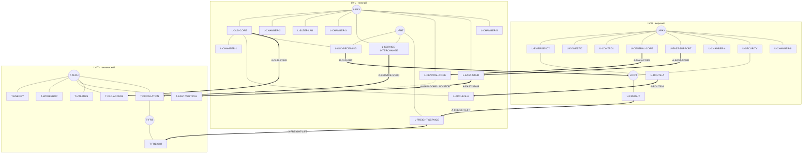

# Комплекс v3 — обзорный граф маршрутов

Артефакт: `OVERVIEW-GRAPH-01`

Статус: `stage-1 / approved`

Граф показывает только крупные сектора, сети и межэтажные переходы. Точные двери, шлюзы и внутренние комнаты появятся в паспортах этапа 2. Закрытые грузовые гермошлюзы камер существуют физически, но не входят в проходимый граф.

## Контролируемые связи сетей

- `U-PAX ↔ U-SECURITY ↔ U-FRT` — двухворотный КПП.
- `L-PAX ↔ L-SERVICE-INTERCHANGE ↔ L-FRT` — двойной шлюз.
- `T-TECH ↔ T-CIRCULATION ↔ T-FRT` — два физически разнесённых контролируемых перехода; на обзорном графе сведены в один узел сектора.

Прямые связи `U-PAX ↔ U-FRT`, `L-PAX ↔ L-FRT` и `T-TECH ↔ T-FRT` запрещены.
