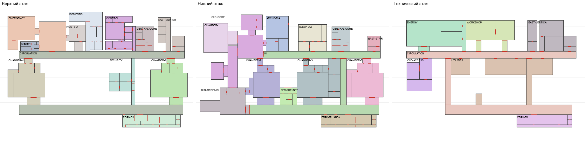

# Комплекс v4 — итоги ревизии

Канонические SVG построены из утверждённых планов v3 (`tools/complex_v3_regeneration/build_canonical_from_approved.py`, привязка — `approved_registration.json`). Каждое исправление принято пользователем и записано в [decisions.md](decisions.md) (D-01…D-42).

## Статус сквозных вопросов

| № | Вопрос | Статус | Чем закрыт |
|---|---|---|---|
| G-01 | Вертикальные опоры между этажами | решено | все шахты совпадают между этажами (±0,03 м), проверка `check_verticals.py`; D-30, D-31, D-33, D-36…D-38, D-41, D-42 |
| G-02 | Грузовые зоны U/L смещены на 5,6 м | решено | магистрали на всех этажах на одной линии, лифт на z 69,56 везде; D-36 |
| G-03 | Магистрали без владельца | решено | владельцы: U-/L-/T-CIRCULATION, проёмы повторяют проёмы соседей; D-39 (инвентарь производственных сцен пока на 30 секторов) |
| G-04 | Анизотропия секторных планов | принято | рамка сектора — по общему плану, внутри — пропорции секторного плана; камеры 4–6 — один модуль; D-35 |
| G-05 | Состояния блокировок и завалов | отложено | сюжетные детали, в геометрии пока не нужны; D-05 |
| G-06 | Двери уже профиля прохода | решено | каталог дверей: wing 1,8×2,8, служебная 1,0×2,1, historic 1,4×2,3, ворота 4,5×4,5, широкий проход 3–6 м; D-09 |
| G-07 | Повторяющиеся чертежи и подписи | решено | камеры №4, №5, №6 — один модуль по образцу №6, подписи по номеру; D-16, D-35 |
| G-08 | Высоты и перекрытия не заданы планами | открыто | высоты стен рабочие (3,4…5,0 м), технический уровень −11,5 м; решение по перекрытиям под тяжёлыми зонами отложено |
| G-09 | Химический протокол: физический контур | решено | газовый коллектор камеры №3, устройство погружения в камере; D-26 (камера №2 — газовая, D-24) |
| G-10 | Положение лаборатории, камер №2 и №3 | решено | правка библии: один контур, терминал №2 в посту камеры №2; D-24, D-25 |
| G-11 | Камеры №5 и №6 стоят друг над другом | решено | принято; скорость ходьбы не менялась; D-17, D-35 |
| G-12 | Узлы из библии, которых нет на планах | открыто | межмировой узел, поверхность и закрытый транспортный коридор — после сюжетных решений; терминал №2 и резерв кресла — отметки, не геометрия |

## Правила, принятые по ходу

- Двери из одного холла в смежные помещения одинаковые по типу и размеру; коридоры открываются в холлы и комнаты широкими проходами (3–6 м), иногда без двери.
- Стены соседних помещений продолжают друг друга, без изломов «в пустоте»; сектора примыкают к магистралям вплотную.
- Камеры №4, №5, №6 — один модуль (образец — №6); коридор z 19,6…25,1 и тяжёлая магистраль z 61,8…69,6 одинаковы на всех этажах.
- Шахты (лифты, лестницы) совпадают между этажами; комната на другом этаже может содержать шахту.

## Этажи целиком

## Сектора

| Сектор | Этаж | Помещений | Анизотропия |
|---|---|---|---|
| [L-ARCHIVE-A](sectors/l-archive-a.md) | LV-L | 3 | 0.5% |
| [L-CENTRAL-CORE](sectors/l-central-core.md) | LV-L | 6 | 0.2% |
| [L-CHAMBER-1](sectors/l-chamber-1.md) | LV-L | 2 | 6.0% |
| [L-CHAMBER-2](sectors/l-chamber-2.md) | LV-L | 7 | 30.4% |
| [L-CHAMBER-3](sectors/l-chamber-3.md) | LV-L | 9 | 6.4% |
| [L-CHAMBER-5](sectors/l-chamber-5.md) | LV-L | 8 | 5.3% |
| [L-CIRCULATION](sectors/l-circulation.md) | LV-L | 3 | 0.0% |
| [L-EAST-STAIR](sectors/l-east-stair.md) | LV-L | 2 | 0.0% |
| [L-FREIGHT-SERVICE](sectors/l-freight-service.md) | LV-L | 8 | 1.0% |
| [L-OLD-CORE](sectors/l-old-core.md) | LV-L | 9 | 16.6% |
| [L-OLD-RECEIVING](sectors/l-old-receiving.md) | LV-L | 6 | 31.8% |
| [L-SERVICE-INTERCHANGE](sectors/l-service-interchange.md) | LV-L | 5 | 4.9% |
| [L-SLEEP-LAB](sectors/l-sleep-lab.md) | LV-L | 5 | 22.4% |
| [T-CIRCULATION](sectors/t-circulation.md) | LV-T | 3 | 28.9% |
| [T-EAST-VERTICAL](sectors/t-east-vertical.md) | LV-T | 7 | 13.2% |
| [T-ENERGY](sectors/t-energy.md) | LV-T | 5 | 36.5% |
| [T-FREIGHT](sectors/t-freight.md) | LV-T | 6 | 12.7% |
| [T-OLD-ACCESS](sectors/t-old-access.md) | LV-T | 3 | 0.9% |
| [T-UTILITIES](sectors/t-utilities.md) | LV-T | 8 | 7.9% |
| [T-WORKSHOP](sectors/t-workshop.md) | LV-T | 4 | 37.7% |
| [U-CENTRAL-CORE](sectors/u-central-core.md) | LV-U | 6 | 0.2% |
| [U-CHAMBER-4](sectors/u-chamber-4.md) | LV-U | 8 | 5.3% |
| [U-CHAMBER-6](sectors/u-chamber-6.md) | LV-U | 8 | 5.3% |
| [U-CIRCULATION](sectors/u-circulation.md) | LV-U | 2 | 0.0% |
| [U-CONTROL](sectors/u-control.md) | LV-U | 12 | 8.8% |
| [U-DOMESTIC](sectors/u-domestic.md) | LV-U | 9 | 0.2% |
| [U-EAST-SUPPORT](sectors/u-east-support.md) | LV-U | 6 | 0.0% |
| [U-EMERGENCY](sectors/u-emergency.md) | LV-U | 4 | 0.0% |
| [U-FREIGHT](sectors/u-freight.md) | LV-U | 12 | 1.0% |
| [U-MEDBAY](sectors/u-medbay.md) | LV-U | 7 | 15.9% |
| [U-ROUTE-A](sectors/u-route-a.md) | LV-U | 4 | 0.0% |
| [U-SECURITY](sectors/u-security.md) | LV-U | 7 | 12.7% |

## Открыто

- Производственные сцены, манифест, валидатор и тесты рассчитаны на 30 секторов; U-/L-CIRCULATION пока только в каноническом наборе.
- VT-OLD-INCLINE (разрушенный наклонный тоннель) — отдельная геометрия.
- G-05, G-08, G-12 — см. таблицу.
