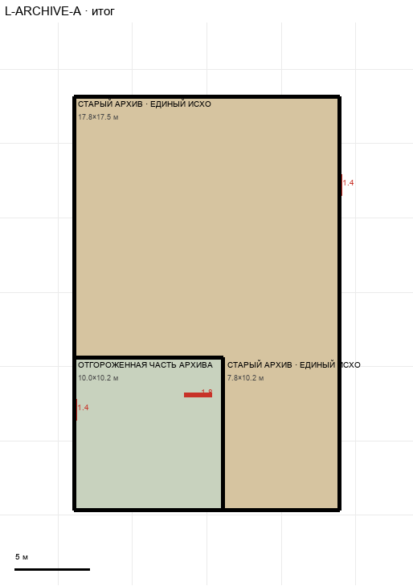

# L-ARCHIVE-A

Этаж: нижний (LV-L). Источник: `docs/design/complex_v3/plans/sectors/lower/l_archive_a.svg`. Высота стен 3.4 м. Габарит 17.8×27.8 м, x -58.9…-41.1, z -8.1…19.6.

## Помещения

| Помещение | Размер, м | м² | Класс |
|---|---|---|---|
| ОТГОРОЖЕННАЯ ЧАСТЬ АРХИВА · НИЖНЯЯ ПЛОЩАДКА ЛЕСТНИЦЫ A | 10.00×10.24 | 102.4 | support |
| СТАРЫЙ АРХИВ · ЕДИНЫЙ ИСХОДНЫЙ КОНТУР | 17.78×17.53 | 311.7 | old |
| СТАРЫЙ АРХИВ · ЕДИНЫЙ ИСХОДНЫЙ КОНТУР | 7.78×10.24 | 79.7 | old |

## Проёмы и двери

door 1.4 м × 2, door 1.8 м × 1

## Решения

- **D-06** — Проём лестницы H1: вся комната 6,7×7,8 м на обоих этажах; двери лестницы 1,8 м
- **D-07** — Лестница под верхней; архив продлён на 2,2 м к югу; архив одним помещением, проход не помещение, лишние проёмы убраны
- **D-08** — Дверь из хола старого ядра — «historic» 1,4×2,3; вход из коридора — широкий проход 4 м
- **D-10** — Лестница без собственных стен слева и сверху: спускается в отгороженную часть архива 10×10,2 м; стена — одна Г-образная, общая с востока по краю лестницы
- **D-21** — Принято: общий доступ прямой x -88,9…-81,1 z 15…48,4 (примыкает к холлу сбоку, проход 6 м), вестибюль и старая лестница 10×13,4 м сдвинуты влево от камеры №2, связка с архивом 2,2×4,4 с дверями historic 1,4 на z 12,2…13,6, ворота в камеру №1 4,5, проходы 4,0, двери ЦУ 1,4. Положение лестницы на T решается позже (вариант C)

## Автонаблюдения

- opening_not_on_sector_wall l_archive_a-opening-007

