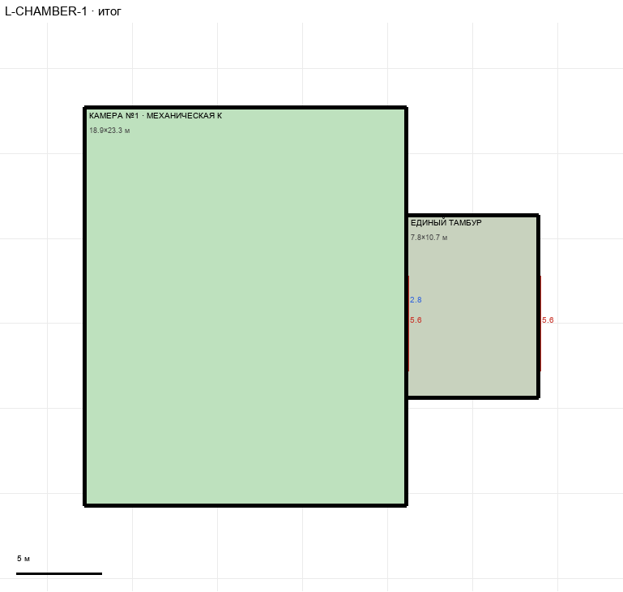

# L-CHAMBER-1

Этаж: нижний (LV-L). Источник: `docs/design/complex_v4/sources/plans/sectors/lower/l_chamber_1.svg`. Высота стен 5.0 м. Габарит 26.7×23.3 м, x -107.8…-81.1, z -2.7…20.7.

## Помещения

| Помещение | Размер, м | м² | Класс |
|---|---|---|---|
| КАМЕРА №1 · МЕХАНИЧЕСКАЯ КЛЕТКА | 18.89×23.33 | 440.8 | containment |
| ЕДИНЫЙ ТАМБУР | 7.78×10.73 | 83.5 | support |

## Проёмы и двери

door 5.6 м × 2, window 2.8 м × 1

## Решения

- **D-22** — Камера №1: ворота нестандартные, оба 5,6 (из клетки в тамбур и из тамбура в холл, «первые, не по каталогу»); тамбур выровнен по холлу (+0,31 м), ворота в холл на z 7,2…12,8 одинаковы в обоих секторах

