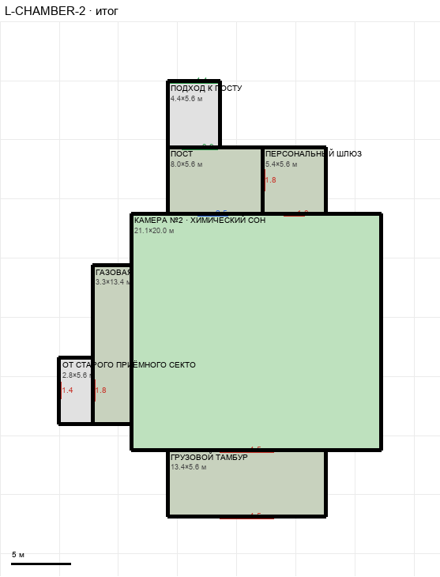

# L-CHAMBER-2

Этаж: нижний (LV-L). Источник: `docs/design/complex_v4/sources/plans/sectors/lower/l_chamber_2.svg`. Высота стен 4.5 м. Габарит 27.2×36.8 м, x -75.0…-47.8, z 25.1…61.8.

## Помещения

| Помещение | Размер, м | м² | Класс |
|---|---|---|---|
| ПОСТ | 8.00×5.60 | 44.8 | support |
| КАМЕРА №2 · ХИМИЧЕСКИЙ СОН | 21.12×20.00 | 422.3 | containment |
| ГАЗОВАЯ | 3.31×13.40 | 44.3 | support |
| ОТ СТАРОГО ПРИЁМНОГО СЕКТОРА | 2.82×5.57 | 15.7 | corridor |
| ГРУЗОВОЙ ТАМБУР | 13.40×5.60 | 75.0 | support |
| ПЕРСОНАЛЬНЫЙ ШЛЮЗ | 5.40×5.60 | 30.2 | support |
| ПОДХОД К ПОСТУ | 4.40×5.57 | 24.5 | corridor |

## Проёмы и двери

door 1.4 м × 1, door 1.8 м × 3, door 4.5 м × 2, opening 3.0 м × 1, opening 4.4 м × 1, window 2.5 м × 1

## Решения

- **D-24** — Пост и персональный шлюз — два помещения (по плану), пост 8,0 м шире влево, шлюз 5,4 м; подход к посту 4,4×5,6 м у левого края поста (по общему плану), проход 3,0 в пост, гермодвери 1,8 пост↔шлюз и шлюз↔камера, окно 2,5; газовая 3,3×13,4 м вплотную к камере, подход к ней по линии стен старого поста (z 48,44…54,01), двери 1,4 (старая часть) и 1,8; грузовой тамбур 13,4×5,6 в створ с постом, ворота 4,5; правило: стены соседних помещений продолжают друг друга, без изломов «в пустоте»; терминал №2 и резерв кресла — отметки, не геометрия

