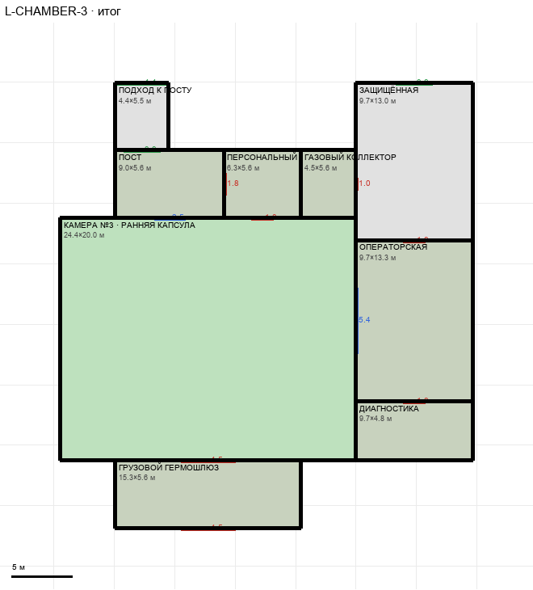

# L-CHAMBER-3

Этаж: нижний (LV-L). Источник: `docs/design/complex_v4/sources/plans/sectors/lower/l_chamber_3.svg`. Высота стен 5.0 м. Габарит 34.1×36.7 м, x -34.4…-0.3, z 25.1…61.8.

## Помещения

| Помещение | Размер, м | м² | Класс |
|---|---|---|---|
| ПОСТ | 9.00×5.60 | 50.4 | support |
| КАМЕРА №3 · РАННЯЯ КАПСУЛА | 24.44×20.00 | 488.9 | containment |
| ЗАЩИЩЁННАЯ | 9.66×12.96 | 125.3 | corridor |
| ОПЕРАТОРСКАЯ | 9.66×13.33 | 128.8 | support |
| ДИАГНОСТИКА | 9.66×4.85 | 46.8 | support |
| ГРУЗОВОЙ ГЕРМОШЛЮЗ | 15.35×5.60 | 85.9 | support |
| ПЕРСОНАЛЬНЫЙ ШЛЮЗ | 6.35×5.60 | 35.6 | support |
| ПОДХОД К ПОСТУ | 4.40×5.54 | 24.4 | corridor |
| ГАЗОВЫЙ КОЛЛЕКТОР | 4.55×5.60 | 25.5 | support |

## Проёмы и двери

door 1.0 м × 1, door 1.8 м × 4, door 4.5 м × 2, opening 3.0 м × 2, opening 4.4 м × 1, window 2.5 м × 1, window 5.4 м × 1

## Решения

- **D-26** — Пост 9,0 и шлюз 6,35 м раздельно (гермодвери 1,8, окно 2,5), подход 4,4 у левого края, газовый коллектор 4,5×5,6 в промежутке (дверь в галерею 1,0), галерея 9,7×12,9 до магистрали (проход 3,0), гермодвери 1,8 галерея→операторская→диагностика, окно в камеру 5,4, грузовой шлюз 15,35×5,6 с воротами 4,5. Устройство погружения — в камере (вариант B), операторская — пульт наблюдения; кресло и подача реагента — отметки, не геометрия. Требование к магистралям (G-03): связующая магистраль x −0,3…4,4 (4,7 м) до стены камеры №5

