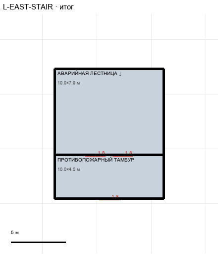

# L-EAST-STAIR

Этаж: нижний (LV-L). Источник: `docs/design/complex_v4/sources/plans/sectors/lower/l_east_stair.svg`. Высота стен 3.8 м. Габарит 10.0×11.9 м, x 21.1…31.1, z 7.7…19.6.

## Помещения

| Помещение | Размер, м | м² | Класс |
|---|---|---|---|
| АВАРИЙНАЯ ЛЕСТНИЦА ↓ | 10.00×7.89 | 78.9 | stair |
| ПРОТИВОПОЖАРНЫЙ ТАМБУР | 10.00×4.00 | 40.0 | stair |

## Проёмы и двери

door 1.8 м × 3

## Решения

- **D-15** — Принято: двери комнат 1,0, противопожарные 1,8 (вместо ворот 9,1), служебный тамбур убран — коридор продлён до главного, лестница удлинена на 3 м на север (10×7,9 м) с проёмом и генератором VT-EAST-STAIR-LU (марш U↔L)

## Автонаблюдения

- opening_not_on_sector_wall l_east_stair-opening-001
- opening_not_on_sector_wall l_east_stair-opening-004
- opening_not_on_sector_wall l_east_stair-opening-007
- opening_not_on_sector_wall l_east_stair-opening-010
- opening_not_on_sector_wall l_east_stair-opening-013

