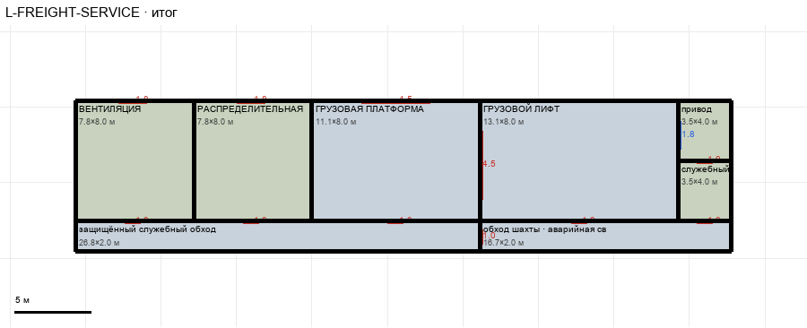

# L-FREIGHT-SERVICE

Этаж: нижний (LV-L). Источник: `docs/design/complex_v4/sources/plans/sectors/lower/l_freight_service.svg`. Высота стен 5.0 м. Габарит 43.4×10.0 м, x -15.7…27.8, z 69.6…79.6.

## Помещения

| Помещение | Размер, м | м² | Класс |
|---|---|---|---|
| ВЕНТИЛЯЦИЯ | 7.83×8.00 | 62.6 | support |
| РАСПРЕДЕЛИТЕЛЬНАЯ | 7.83×8.00 | 62.6 | support |
| ГРУЗОВАЯ ПЛАТФОРМА | 11.11×8.00 | 88.9 | cargo |
| защищённый служебный обход нижнего грузового блока | 26.77×2.00 | 53.5 | walkway |
| ГРУЗОВОЙ ЛИФТ | 13.13×8.00 | 105.0 | lift |
| привод | 3.54×4.00 | 14.1 | support |
| служебный | 3.54×4.00 | 14.1 | support |
| обход шахты · аварийная связь | 16.67×2.00 | 33.3 | walkway |

## Проёмы и двери

door 1.0 м × 7, door 1.8 м × 2, door 4.5 м × 2, window 1.85 м × 1

## Решения

- **D-19** — Ворота тракта 4,5×4,5 м в пределах помещений (изолятор тоже), дверь обход шахты ↔ пешеходная полоса, защитный коридор слева (вариант A) с дверью в магистраль, проём шахты лифта; G-02 вариант A: нижний грузовой блок +5,6 м к югу под верхний
- **D-34** — Двери в магистраль: вентиляция и распределительная wing 1,8, платформа ворота 4,5; платформа↔лифт ворота 4,5; привод↔служебный 1,0; двери 1,0 в обходы (из вентиляции, распределительной, платформы; обход↔обход шахты; обход шахты↔лифт; обход шахты↔служебный)

