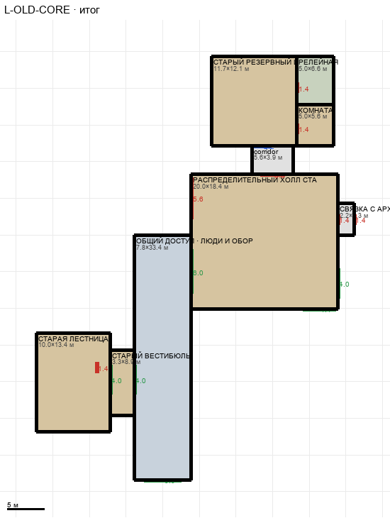

# L-OLD-CORE

Этаж: нижний (LV-L). Источник: `docs/design/complex_v4/sources/plans/sectors/lower/l_old_core.svg`. Высота стен 3.4 м. Габарит 43.3×57.7 м, x -102.2…-58.9, z -9.3…48.4.

## Помещения

| Помещение | Размер, м | м² | Класс |
|---|---|---|---|
| СТАРЫЙ РЕЗЕРВНЫЙ ЦУ | 11.67×12.14 | 141.6 | old |
| РЕЛЕЙНАЯ | 5.00×6.56 | 32.8 | support |
| КОМНАТА | 5.00×5.58 | 27.9 | old |
| corridor | 5.56×3.94 | 21.9 | corridor |
| РАСПРЕДЕЛИТЕЛЬНЫЙ ХОЛЛ СТАРОГО ЯДРА | 20.00×18.37 | 367.3 | old |
| ОБЩИЙ ДОСТУП · ЛЮДИ И ОБОРУДОВАНИЕ | 7.79×33.35 | 259.9 | mixed |
| СТАРЫЙ ВЕСТИБЮЛЬ | 3.30×8.90 | 29.4 | old |
| СТАРАЯ ЛЕСТНИЦА | 10.00×13.40 | 134.0 | old |
| СВЯЗКА С АРХИВОМ | 2.22×4.35 | 9.7 | corridor |

## Проёмы и двери

door 1.4 м × 5, door 3.33 м × 1, door 5.6 м × 1, opening 4.0 м × 3, opening 4.4 м × 1, opening 5.0 м × 1, opening 6.0 м × 1, window 2.22 м × 1

## Решения

- **D-21** — Принято: общий доступ прямой x -88,9…-81,1 z 15…48,4 (примыкает к холлу сбоку, проход 6 м), вестибюль и старая лестница 10×13,4 м сдвинуты влево от камеры №2, связка с архивом 2,2×4,4 с дверями historic 1,4 на z 12,2…13,6, ворота в камеру №1 4,5, проходы 4,0, двери ЦУ 1,4. Положение лестницы на T решается позже (вариант C)
- **D-22** — Камера №1: ворота нестандартные, оба 5,6 (из клетки в тамбур и из тамбура в холл, «первые, не по каталогу»); тамбур выровнен по холлу (+0,31 м), ворота в холл на z 7,2…12,8 одинаковы в обоих секторах

