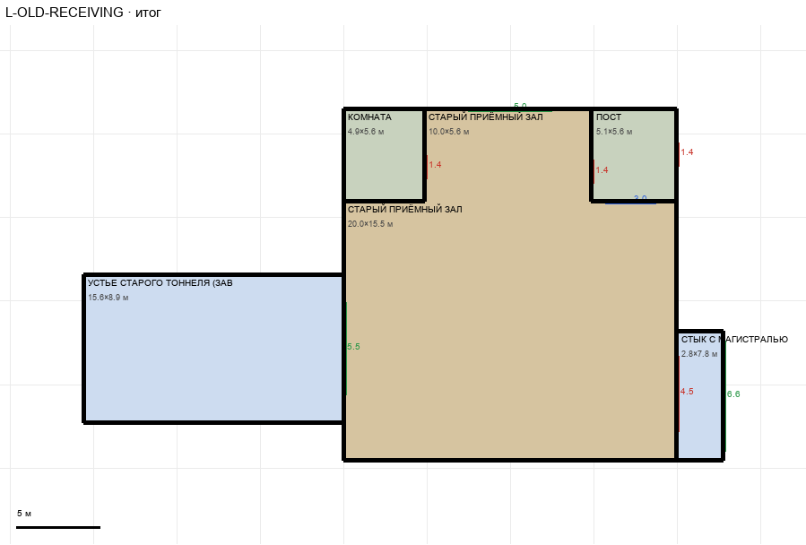

# L-OLD-RECEIVING

Этаж: нижний (LV-L). Источник: `docs/design/complex_v4/sources/plans/sectors/lower/l_old_receiving.svg`. Высота стен 5.0 м. Габарит 38.4×21.1 м, x -110.6…-72.2, z 48.4…69.6.

## Помещения

| Помещение | Размер, м | м² | Класс |
|---|---|---|---|
| ПОСТ | 5.11×5.57 | 28.5 | support |
| КОМНАТА | 4.88×5.57 | 27.2 | support |
| УСТЬЕ СТАРОГО ТОННЕЛЯ (ЗАВАЛ) | 15.59×8.90 | 138.7 | heavy |
| СТЫК С МАГИСТРАЛЬЮ | 2.80×7.78 | 21.8 | heavy |
| СТАРЫЙ ПРИЁМНЫЙ ЗАЛ | 10.00×5.57 | 55.7 | old |
| СТАРЫЙ ПРИЁМНЫЙ ЗАЛ | 19.99×15.54 | 310.7 | old |

## Проёмы и двери

door 1.4 м × 3, door 4.5 м × 1, opening 5.0 м × 1, opening 5.5 м × 1, opening 6.6 м × 1, window 2.98 м × 1

## Решения

- **D-23** — Зал сдвинут на 2,8 м влево — центр по общему доступу; магистраль входит справа через стык 2,8×7,8 и ворота 4,5; нижняя стена глухая; устье тоннеля 15,6×8,9 (завал) с проходом 5,5; «коридор» убран, общий доступ входит проходом 5,0; двери комнат 1,4; форма зала по плану (вариант A)

