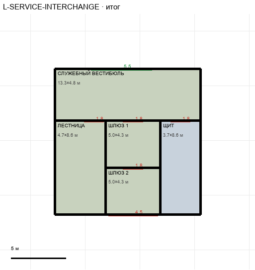

# L-SERVICE-INTERCHANGE

Этаж: нижний (LV-L). Источник: `docs/design/complex_v4/sources/plans/sectors/lower/l_service_interchange.svg`. Высота стен 5.0 м. Габарит 13.3×13.3 м, x -47.8…-34.4, z 48.4…61.8.

## Помещения

| Помещение | Размер, м | м² | Класс |
|---|---|---|---|
| СЛУЖЕБНЫЙ ВЕСТИБЮЛЬ | 13.33×4.76 | 63.5 | support |
| ЛЕСТНИЦА | 4.67×8.57 | 40.0 | support |
| ШЛЮЗ 1 | 5.00×4.29 | 21.5 | support |
| ЩИТ | 3.67×8.57 | 31.4 | equipment-room |
| ШЛЮЗ 2 | 5.00×4.28 | 21.4 | support |

## Проёмы и двери

door 1.8 м × 4, door 4.5 м × 1, opening 5.55 м × 1

## Решения

- **D-27** — Шлюз 1 и шлюз 2 раздельно (по 5,0×4,3, гермодверь 1,8 между ними), двери вестибюля в лестницу/шлюз/щит одинаковые противопожарные 1,8×2,8, вход с подхода проход 5,6 м, ворота шлюза 2 в тяжёлую магистраль 4,5 м; положение лестницы на T решается с G-01

