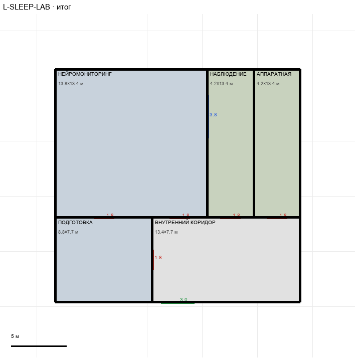

# L-SLEEP-LAB

Этаж: нижний (LV-L). Источник: `docs/design/complex_v3/plans/sectors/lower/l_sleep_lab.svg`. Высота стен 3.4 м. Габарит 22.2×21.1 м, x -33.3…-11.1, z -1.5…19.6.

## Помещения

| Помещение | Размер, м | м² | Класс |
|---|---|---|---|
| ВНУТРЕННИЙ КОРИДОР | 13.41×7.68 | 102.9 | corridor |
| НЕЙРОМОНИТОРИНГ | 13.79×13.43 | 185.3 | lab |
| НАБЛЮДЕНИЕ | 4.21×13.43 | 56.6 | support |
| АППАРАТНАЯ | 4.21×13.43 | 56.6 | support |
| ПОДГОТОВКА | 8.81×7.68 | 67.6 | lab |

## Проёмы и двери

door 1.8 м × 5, opening 3.0 м × 1, window 3.84 м × 1

## Решения

- **D-25** — Двери из коридора во все комнаты лаборатории одинаковые wing 1,8×2,8 (в т.ч. новая дверь в нейромониторинг); дверь подготовка↔нейромониторинг тоже wing 1,8 по центру стены; вход с магистрали проём 3,0 м; кабельная связь с №3 — отметка. G-10 вариант A: библия поправлена — лаборатория, №2 и №3 в одном контуре (магистраль и кабельные трассы), терминал №2 в посту камеры №2, шлюз №3 — собственный к магистрали

