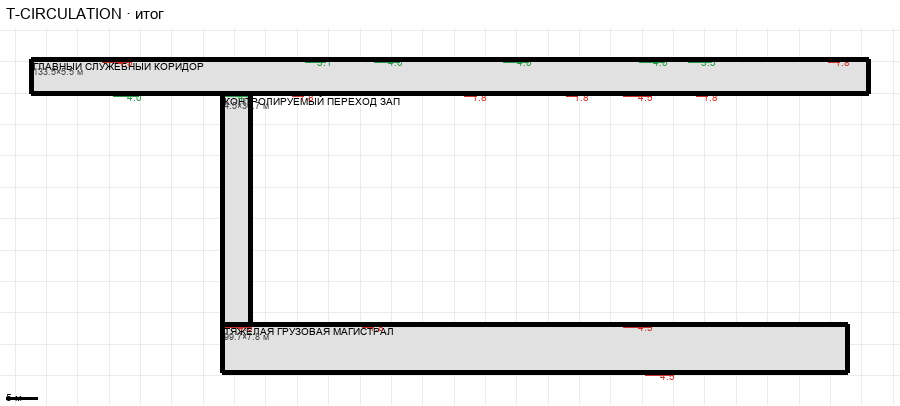

# T-CIRCULATION

Этаж: технический (LV-T). Источник: `docs/design/complex_v4/sources/plans/sectors/technical/t_circulation.svg`. Высота стен 4.5 м. Габарит 133.5×50.0 м, x -102.4…31.1, z 19.6…69.6.

## Помещения

| Помещение | Размер, м | м² | Класс |
|---|---|---|---|
| ГЛАВНЫЙ СЛУЖЕБНЫЙ КОРИДОР | 133.50×5.50 | 734.2 | corridor |
| КОНТРОЛИРУЕМЫЙ ПЕРЕХОД ЗАПАД | 4.50×36.70 | 165.2 | corridor |
| ТЯЖЁЛАЯ ГРУЗОВАЯ МАГИСТРАЛЬ | 99.70×7.80 | 777.7 | corridor |

## Проёмы и двери

door 1.8 м × 6, door 4.5 м × 5, opening 3.1 м × 1, opening 3.5 м × 1, opening 4.0 м × 4, opening 4.5 м × 1

## Решения

- **D-37** — T-CIRCULATION владеет только коридором 133,5×5,5, западным переходом и тяжёлой магистралью (двери совпадают с дверьми соседей), галерея не рисуется; T-UTILITIES: комнаты вплотную к коридору, лестница служебной развязки под лестницей L и выходом в магистраль; T-ENERGY/WORKSHOP/EAST-VERTICAL/OLD-ACCESS подогнаны под коридор z 19,6…25,1

