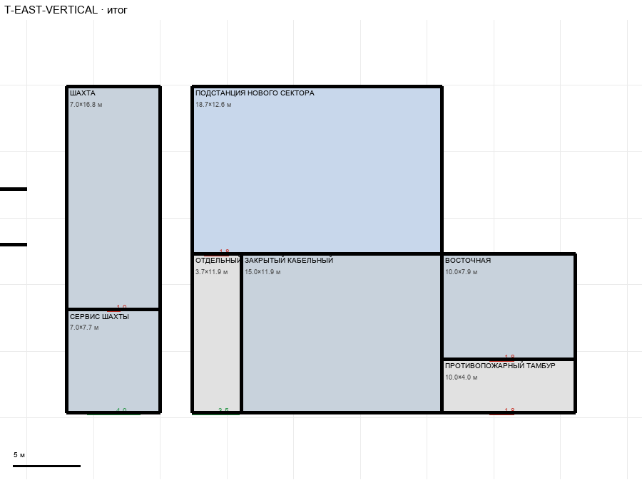

# T-EAST-VERTICAL

Этаж: технический (LV-T). Источник: `docs/design/complex_v3/plans/sectors/technical/t_east_vertical.svg`. Высота стен 4.5 м. Габарит 38.1×24.5 м, x -7.0…31.1, z -4.9…19.6.

## Помещения

| Помещение | Размер, м | м² | Класс |
|---|---|---|---|
| ШАХТА | 7.03×16.76 | 117.8 | shaft |
| СЕРВИС ШАХТЫ | 7.03×7.73 | 54.3 | room |
| ПОДСТАНЦИЯ НОВОГО СЕКТОРА | 18.70×12.57 | 235.2 | energy |
| ОТДЕЛЬНЫЙ СЛУЖЕБНЫЙ ПОДХОД | 3.67×11.91 | 43.7 | corridor |
| ЗАКРЫТЫЙ КАБЕЛЬНЫЙ | 15.03×11.91 | 179.1 | room |
| ВОСТОЧНАЯ | 10.00×7.89 | 79.0 | shaft |
| ПРОТИВОПОЖАРНЫЙ ТАМБУР | 10.00×4.02 | 40.2 | corridor |

## Проёмы и двери

door 1.0 м × 1, door 1.8 м × 3, opening 3.5 м × 1, opening 4.0 м × 1

## Решения

- **D-31** — Комнаты T содержат опоры верхних этажей: шахта 7,0×16,8 сдвинута на +8,5 м, лифт L (x −7…−2) внутри у западной стены; восточная лестница 10×7,9 под лестницей U/L (x 21,1…31,1), тамбур 10×2,6 до коридора z 18,2, противопожарные двери 1,8; подстанция 18,7×12,6 (правая стена по лестнице), подход 3,7 с проходом в коридор, дверь в подстанцию wing 1,8; приямок растянут до 15 м (без дверей); люк сервис↔шахта 1,0; сервис→коридор проход 4,0; лишние стенки в шахте убраны

## Автонаблюдения

- room_without_drawn_opening T-EAST-VERTICAL/zakrytyy-kabelnyy

