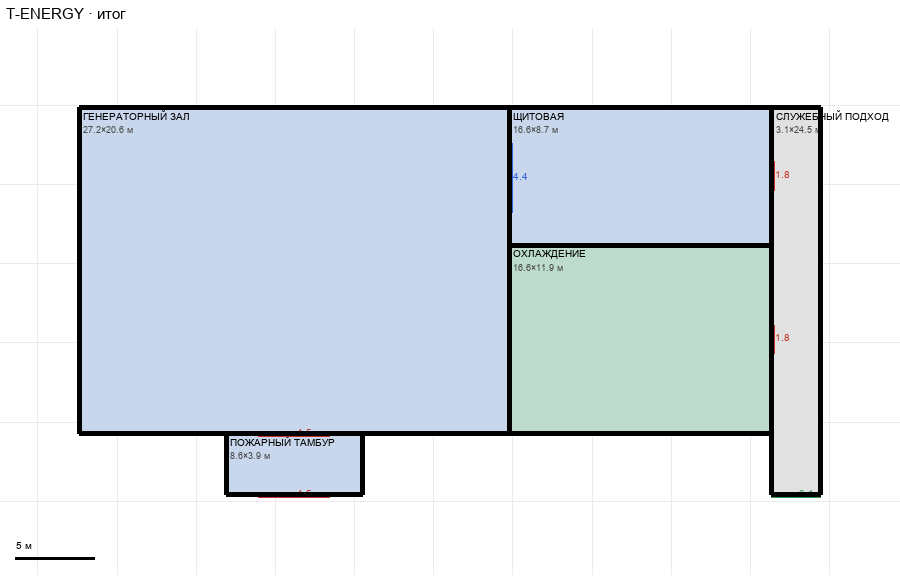

# T-ENERGY

Этаж: технический (LV-T). Источник: `docs/design/complex_v4/sources/plans/sectors/technical/t_energy.svg`. Высота стен 4.5 м. Габарит 46.9×24.5 м, x -102.4…-55.5, z -4.9…19.6.

## Помещения

| Помещение | Размер, м | м² | Класс |
|---|---|---|---|
| ГЕНЕРАТОРНЫЙ ЗАЛ | 27.18×20.63 | 560.6 | energy |
| ПОЖАРНЫЙ ТАМБУР | 8.62×3.86 | 33.3 | energy |
| ЩИТОВАЯ | 16.57×8.71 | 144.3 | energy |
| ОХЛАЖДЕНИЕ | 16.57×11.92 | 197.5 | utility |
| СЛУЖЕБНЫЙ ПОДХОД | 3.10×24.49 | 75.9 | corridor |

## Проёмы и двери

door 1.8 м × 2, door 4.5 м × 2, opening 3.1 м × 1, window 4.35 м × 1

## Решения

- **D-28** — Служебный карман убран (не нужен), подход сужен до 3,1 м (не заходит в мастерскую) и открыт в главный коридор проходом 3,1; двери подхода в щитовую и охлаждение wing 1,8; ворота пожарного тамбура 4,5; окно зал↔щитовая 4,4; пропорции зала по плану сектора (27,2 м)
- **D-29** — Два служебных подъезда 4,0×7,5 м от мастерской и склада до главного коридора (проходы 4,0 без дверей), проход мастерская↔склад 3,6; прохода из подхода энергоблока в мастерскую нет (решение пользователя); T-ENERGY: тамбур 2,5 м и подход 23,1 м упираются в коридор z 18,24

