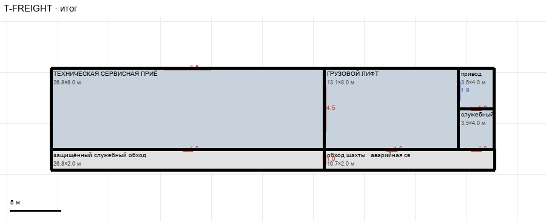

# T-FREIGHT

Этаж: технический (LV-T). Источник: `docs/design/complex_v4/sources/plans/sectors/technical/t_freight.svg`. Высота стен 4.5 м. Габарит 43.5×10.0 м, x -15.7…27.8, z 69.6…79.6.

## Помещения

| Помещение | Размер, м | м² | Класс |
|---|---|---|---|
| ТЕХНИЧЕСКАЯ СЕРВИСНАЯ ПРИЁМКА | 26.80×8.00 | 214.4 | work |
| защищённый служебный обход технической приёмки | 26.80×2.00 | 53.6 | corridor |
| ГРУЗОВОЙ ЛИФТ | 13.10×8.00 | 104.8 | shaft |
| привод | 3.50×4.00 | 14.0 | room |
| служебный | 3.50×4.00 | 14.0 | room |
| обход шахты · аварийная связь | 16.70×2.00 | 33.4 | corridor |

## Проёмы и двери

door 1.0 м × 5, door 4.5 м × 2, window 1.9 м × 1

## Решения

- **D-33** — Контур как на U/L (подпись плана «тот же шахтный контур»): приёмка 26,8×8,0, защищённый обход 26,8×2,0, лифт 13,1×8,0 ровно под лифтом L (x 11,1…24,2, z 75,2…83,2), привод/служебный 3,5×4,0, обход шахты 16,7×2,0; ворота 4,5 в магистраль и в лифт, служебные двери 1,0, окно 1,9, проём шахты в потолке (VT-FREIGHT-LIFT). Требование к T-CIRCULATION: тяжёлая магистраль T +10 м, нижняя кромка на z 75,2

