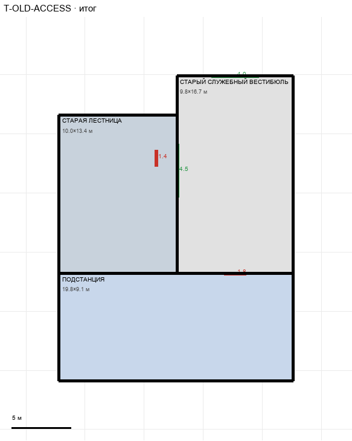

# T-OLD-ACCESS

Этаж: технический (LV-T). Источник: `docs/design/complex_v4/sources/plans/sectors/technical/t_old_access.svg`. Высота стен 4.5 м. Габарит 19.8×25.8 м, x -102.2…-82.4, z 25.1…50.9.

## Помещения

| Помещение | Размер, м | м² | Класс |
|---|---|---|---|
| СТАРАЯ ЛЕСТНИЦА | 10.00×13.40 | 134.0 | shaft |
| СТАРЫЙ СЛУЖЕБНЫЙ ВЕСТИБЮЛЬ | 9.81×16.70 | 163.8 | corridor |
| ПОДСТАНЦИЯ | 19.81×9.07 | 179.7 | energy |

## Проёмы и двери

door 1.4 м × 1, door 1.8 м × 1, opening 4.0 м × 1, opening 4.5 м × 1

## Решения

- **D-30** — Вариант C по лестнице: лестница на T 10×13,4 м совпадает с нижним этажом (x -102,2…-92,2, z 28,4…41,8); вестибюль 9,8×17,6 придвинут к лестнице, проход 4,5; вход из коридора проход 4,0; подстанция 19,8×9,1 под лестницей и вестибюлем (правая стена по вестибюлю), дверь wing 1,8 (стандартная, не проход); боковой доступ удалён. Проём лестницы создаст генератор VT-OLD-STAIR (общий раздел вертикалей)

