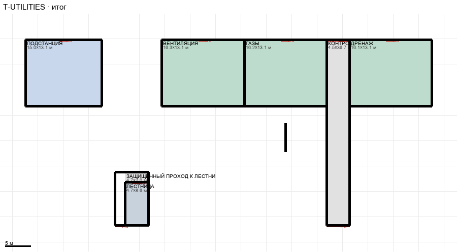

# T-UTILITIES

Этаж: технический (LV-T). Источник: `docs/design/complex_v3/plans/sectors/technical/t_utilities.svg`. Высота стен 4.2 м. Габарит 80.0×36.7 м, x -67.4…12.6, z 25.1…61.8.

## Помещения

| Помещение | Размер, м | м² | Класс |
|---|---|---|---|
| ПОДСТАНЦИЯ | 15.00×13.12 | 196.8 | energy |
| ЛЕСТНИЦА | 4.67×8.59 | 40.1 | shaft |
| ВЕНТИЛЯЦИЯ | 16.30×13.12 | 213.9 | utility |
| ГАЗЫ | 16.20×13.12 | 212.5 | utility |
| КОНТРОЛИРУЕМЫЙ ГРУЗОВОЙ ПЕРЕХОД | 4.50×36.70 | 165.2 | corridor |
| ДРЕНАЖ | 16.15×13.12 | 211.9 | utility |
| ЗАЩИЩЁННЫЙ ПРОХОД К ЛЕСТНИЦЕ | 2.00×10.59 | 21.2 | corridor |
| ЗАЩИЩЁННЫЙ ПРОХОД К ЛЕСТНИЦЕ | 4.67×2.00 | 9.3 | corridor |

## Проёмы и двери

door 1.8 м × 6, door 4.5 м × 2

## Решения

- **D-32** — Подходы открыты в коридор проходами 3,0 без дверей, в комнаты двери wing 1,8, тамбур лестницы — противопожарные 1,8, грузовой переход 4,5 с воротами 4,5 на концах; четыре запертые комнатки-ввода и стенка в газовой убраны (отметки в отчёте); положение лестницы служебной развязки на T (G-01: z 31…48 вместо 53…62) решается вместе с T-CIRCULATION и T-FREIGHT
- **D-42** — Защищённый проход к лестнице — одно сплошное помещение Г-образной формы (кусочки одной группы без внутренней стены, общий space id): проход 2,0 м вдоль западной стены лестницы от тяжёлой магистрали (противопожарная дверь 1,8) и тамбур 4,7×2,0 над лестницей; вход на лестницу с T с севера, как на L (дверь 1,8, роль entry/exit), оборот на 180°; шахта 4,65×8,55, генератор service_stair хостится L-SERVICE-INTERCHANGE; все лестницы реестра генерируются (7 из 8, наклонный тоннель — отдельная геометрия)

