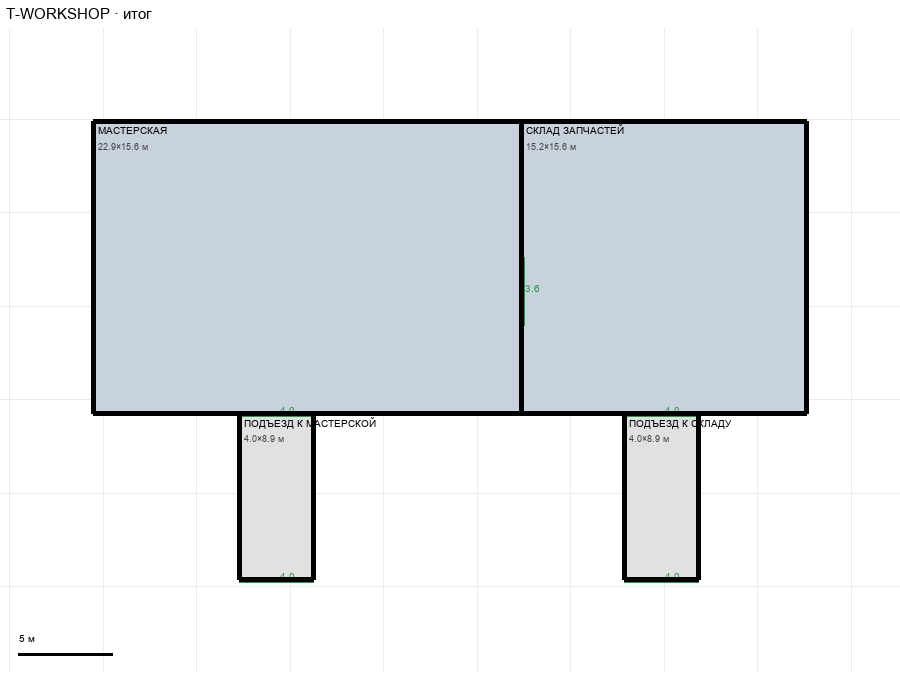

# T-WORKSHOP

Этаж: технический (LV-T). Источник: `docs/design/complex_v3/plans/sectors/technical/t_workshop.svg`. Высота стен 4.5 м. Габарит 38.1×24.5 м, x -55.5…-17.4, z -4.9…19.6.

## Помещения

| Помещение | Размер, м | м² | Класс |
|---|---|---|---|
| МАСТЕРСКАЯ | 22.88×15.63 | 357.4 | work |
| СКЛАД ЗАПЧАСТЕЙ | 15.25×15.63 | 238.3 | work |
| ПОДЪЕЗД К МАСТЕРСКОЙ | 4.00×8.86 | 35.4 | corridor |
| ПОДЪЕЗД К СКЛАДУ | 4.00×8.86 | 35.4 | corridor |

## Проёмы и двери

opening 3.6 м × 1, opening 4.0 м × 4

## Решения

- **D-29** — Два служебных подъезда 4,0×7,5 м от мастерской и склада до главного коридора (проходы 4,0 без дверей), проход мастерская↔склад 3,6; прохода из подхода энергоблока в мастерскую нет (решение пользователя); T-ENERGY: тамбур 2,5 м и подход 23,1 м упираются в коридор z 18,24

