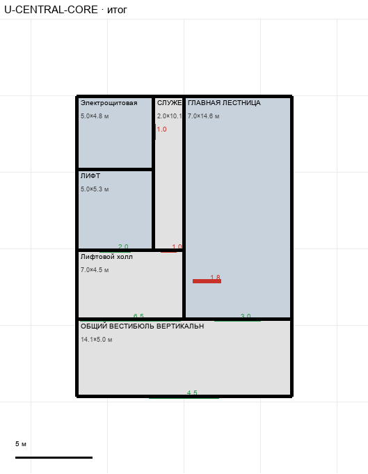

# U-CENTRAL-CORE

Этаж: верхний (LV-U). Источник: `docs/design/complex_v4/sources/plans/sectors/upper/u_central_core.svg`. Высота стен 3.4 м. Габарит 14.1×19.6 м, x -7.0…7.0, z 0.0…19.6.

## Помещения

| Помещение | Размер, м | м² | Класс |
|---|---|---|---|
| Электрощитовая | 5.02×4.78 | 24.0 | service |
| СЛУЖЕБНЫЙ ДОСТУП · 1,5 М | 2.01×10.05 | 20.2 | passenger |
| ЛИФТ | 5.02×5.28 | 26.5 | vertical |
| Лифтовой холл | 7.03×4.52 | 31.8 | passenger |
| ГЛАВНАЯ ЛЕСТНИЦА | 7.03×14.58 | 102.4 | vertical |
| ОБЩИЙ ВЕСТИБЮЛЬ ВЕРТИКАЛЬНОГО УЗЛА | 14.05×5.03 | 70.6 | passenger |

## Проёмы и двери

door 1.0 м × 2, door 1.8 м × 1, opening 2.01 м × 1, opening 3.0 м × 1, opening 4.52 м × 1, opening 6.52 м × 1

## Решения

- **D-14** — Лестница одной комнатой с площадкой (без стены между ними), щели 0,5 м между комнатами ядра закрыты (общие стены), проёмы лифта и лестницы размечены; двери служебные 1,0; вход на площадку проходом 3,0; генератор главной лестницы добавлен (VT-MAIN-STAIR)
- **D-40** — Тамбур у ядра убран, ядро сдвинуто ещё на 2,5 м: общий вестибюль примыкает к коридору проёмом 4,5 м; дорисованы недостающие встречные проёмы (L-OLD-CORE: связка с архивом, подход камеры №2, общий доступ; L-OLD-RECEIVING: дверь к подходу газовой; U-ROUTE-A: дверь к аварийному блоку на уровне двери U-EMERGENCY); главный лифт T: комната содержит лифт L (z 4,78…10,06)

