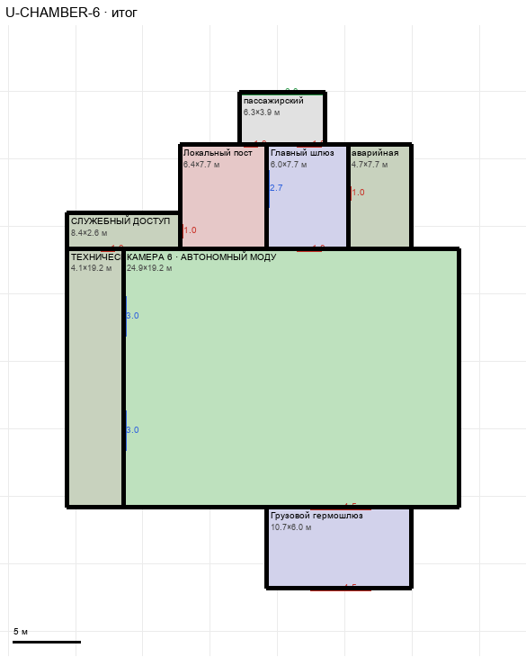

# U-CHAMBER-6

Этаж: верхний (LV-U). Источник: `docs/design/complex_v4/sources/plans/sectors/upper/u_chamber_6.svg`. Высота стен 5.0 м. Габарит 29.0×36.7 м, x 4.4…33.4, z 25.1…61.8.

## Помещения

| Помещение | Размер, м | м² | Класс |
|---|---|---|---|
| пассажирский | 6.34×3.86 | 24.5 | passenger |
| Локальный пост | 6.42×7.70 | 49.5 | security |
| Главный шлюз | 6.05×7.70 | 46.6 | airlock |
| аварийная | 4.67×7.70 | 35.9 | support |
| ТЕХНИЧЕСКАЯ ГАЛЕРЕЯ | 4.15×19.18 | 79.6 | support |
| КАМЕРА 6 · АВТОНОМНЫЙ МОДУЛЬ | 24.89×19.18 | 477.4 | containment |
| Грузовой гермошлюз | 10.72×5.96 | 63.8 | airlock |
| СЛУЖЕБНЫЙ ДОСТУП | 8.38×2.62 | 22.0 | support |

## Проёмы и двери

door 1.0 м × 4, door 1.8 м × 2, door 4.5 м × 2, opening 6.34 м × 1, window 2.73 м × 1, window 2.95 м × 2

## Решения

- **D-16** — Серийный модуль: зазоры закрыты, один подход, служебный доступ объединён, двери шлюзов 1,8 (гермо), служебные 1,0, грузовые ворота 4,5, дверь в автоматику; подписи по номеру камеры
- **D-17** — Положение камер №5 и №6 принято как на общем плане (G-11 вариант A); скорость ходьбы не менять до игровых тестов
- **D-35** — Камеры одинаковые по образцу №6 (29,0×36,7 м, подход укорочен на 0,7 м), лежат между коридором (z 25,1) и тяжёлой магистралью (z 61,8); №6 и №5 строго друг под другом (x 4,4…33,4), №4 на x −107,8…−78,7; проём подхода в коридор

