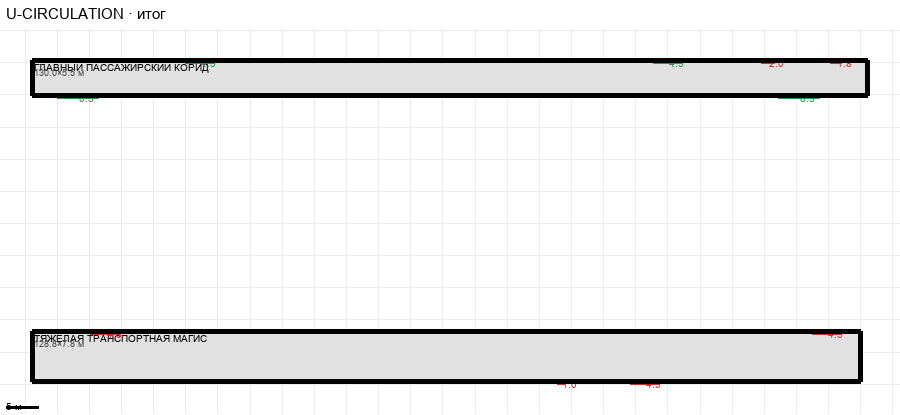

# U-CIRCULATION

Этаж: верхний (LV-U). Источник: `synthetic: overview of the level`. Высота стен 4.5 м. Габарит 130.0×50.0 м, x -98.9…31.1, z 19.6…69.6.

## Помещения

| Помещение | Размер, м | м² | Класс |
|---|---|---|---|
| ГЛАВНЫЙ ПАССАЖИРСКИЙ КОРИДОР | 130.00×5.50 | 715.0 | corridor |
| ТЯЖЁЛАЯ ТРАНСПОРТНАЯ МАГИСТРАЛЬ | 128.80×7.80 | 1004.6 | corridor |

## Проёмы и двери

door 1.0 м × 1, door 1.8 м × 1, door 2.04 м × 1, door 4.5 м × 3, opening 4.5 м × 1, opening 4.52 м × 1, opening 6.34 м × 2

## Решения

- **D-39** — Новые сектора без утверждённого плана, собираются из общего плана этажа: U — пассажирский коридор z 19,6…25,1 и тяжёлая магистраль z 61,8…69,6; L — то же плюс связующий коридор x −0,3…4,4; проёмы и двери на их стенах повторяют проёмы соседей (`sync_circulation.py`), консистентность стен — `check_cross_openings.py`. Каноническое число секторов 32; производственный манифест, каталог сцен и тесты пока на 30 (дальше)

