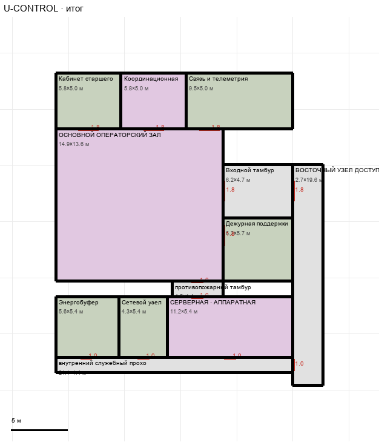

# U-CONTROL

Этаж: верхний (LV-U). Источник: `docs/design/complex_v4/sources/plans/sectors/upper/u_control.svg`. Высота стен 3.4 м. Габарит 23.8×27.8 м, x -31.1…-7.3, z -8.2…19.6.

## Помещения

| Помещение | Размер, м | м² | Класс |
|---|---|---|---|
| Кабинет старшего | 5.79×4.97 | 28.8 | support |
| Координационная | 5.79×4.97 | 28.8 | command |
| Связь и телеметрия | 9.52×4.97 | 47.3 | support |
| ОСНОВНОЙ ОПЕРАТОРСКИЙ ЗАЛ | 14.91×13.56 | 202.1 | command |
| Входной тамбур | 6.20×4.75 | 29.4 | corridor |
| Дежурная поддержки | 6.20×5.65 | 35.0 | support |
| противопожарный тамбур | 4.55×1.36 | 6.2 | corridor |
| Энергобуфер | 5.59×5.42 | 30.3 | support |
| Сетевой узел | 4.35×5.42 | 23.6 | support |
| СЕРВЕРНАЯ · АППАРАТНАЯ | 11.18×5.42 | 60.6 | command |
| внутренний служебный проход аппаратной | 21.11×1.35 | 28.6 | corridor |
| ВОСТОЧНЫЙ УЗЕЛ ДОСТУПА | 2.69×19.65 | 52.9 | corridor |

## Проёмы и двери

door 1.0 м × 6, door 1.8 м × 6

## Решения

- **D-13** — Предложение принято: двери хола 1,8 / служебные 1,0; дверь во входной тамбур с востока; восточная полоса не заходит в коридор; противопожарный тамбур сдвинут под хол/серверную (x -20,75..-16,2) с двумя дверями 1,0; окно в кабинете старшего убрано (перекрывалось дверью)

## Автонаблюдения

- opening_not_on_sector_wall u_control-annotation-006

