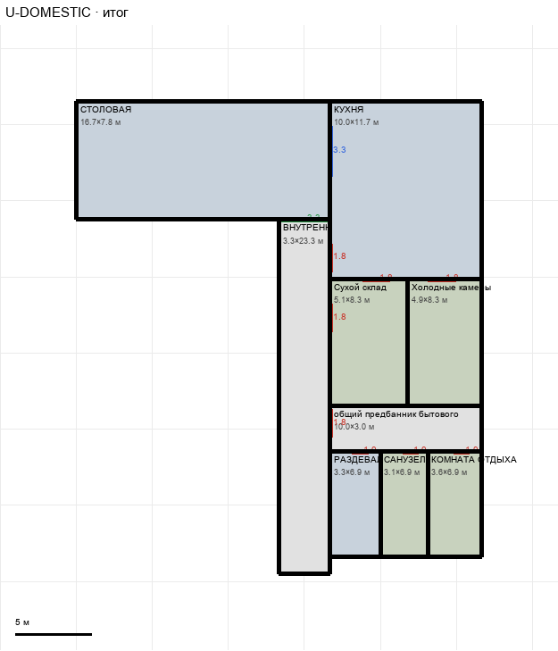

# U-DOMESTIC

Этаж: верхний (LV-U). Источник: `docs/design/complex_v4/sources/plans/sectors/upper/u_domestic.svg`. Высота стен 5.0 м. Габарит 26.7×31.1 м, x -60.0…-33.3, z -11.6…19.5.

## Помещения

| Помещение | Размер, м | м² | Класс |
|---|---|---|---|
| СТОЛОВАЯ | 16.67×7.77 | 129.4 | domestic |
| ВНУТРЕННИЙ КОРИДОР БЫТОВОГО КРЫЛА · 3 М | 3.33×23.30 | 77.7 | corridor |
| КУХНЯ | 10.00×11.67 | 116.7 | domestic |
| Сухой склад | 5.11×8.34 | 42.6 | support |
| Холодные камеры | 4.89×8.34 | 40.8 | support |
| общий предбанник бытового блока | 10.00×3.00 | 30.0 | corridor |
| РАЗДЕВАЛКА | 3.33×6.92 | 23.1 | domestic |
| САНУЗЕЛ · ДУШ | 3.11×6.92 | 21.5 | support |
| КОМНАТА ОТДЫХА | 3.56×6.92 | 24.6 | support |

## Проёмы и двери

door 1.0 м × 3, door 1.8 м × 5, opening 3.33 м × 1, window 3.3 м × 1

## Решения

- **D-12** — Вариант B: столовая вплотную к кухне (+3,3 м), окно выдачи 3,3 м, коридор открыт в столовую проходом 3,3 м; предбанник 3,0 м, раздевалки сдвинуты вниз без уменьшения; двери по каталогу

## Автонаблюдения

- opening_not_on_sector_wall u_domestic-annotation-001

