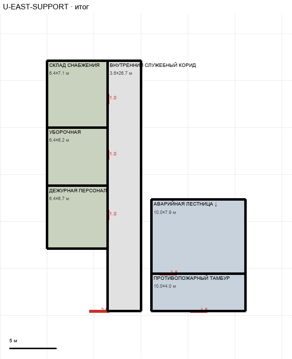

# U-EAST-SUPPORT

Этаж: верхний (LV-U). Источник: `docs/design/complex_v3/plans/sectors/upper/u_east_support.svg`. Высота стен 3.4 м. Габарит 21.1×26.7 м, x 10.0…31.1, z -7.1…19.6.

## Помещения

| Помещение | Размер, м | м² | Класс |
|---|---|---|---|
| СКЛАД СНАБЖЕНИЯ | 6.44×7.11 | 45.8 | support |
| УБОРОЧНАЯ | 6.44×6.22 | 40.1 | support |
| ДЕЖУРНАЯ ПЕРСОНАЛА | 6.44×6.67 | 43.0 | support |
| ВНУТРЕННИЙ СЛУЖЕБНЫЙ КОРИДОР · 2 М | 3.56×26.67 | 94.8 | corridor |
| АВАРИЙНАЯ ЛЕСТНИЦА ↓ | 10.00×7.89 | 78.9 | stair |
| ПРОТИВОПОЖАРНЫЙ ТАМБУР | 10.00×4.00 | 40.0 | stair |

## Проёмы и двери

door 1.0 м × 3, door 1.8 м × 2, door 2.04 м × 1

## Решения

- **D-15** — Принято: двери комнат 1,0, противопожарные 1,8 (вместо ворот 9,1), служебный тамбур убран — коридор продлён до главного, лестница удлинена на 3 м на север (10×7,9 м) с проёмом и генератором VT-EAST-STAIR-LU (марш U↔L)

## Автонаблюдения

- opening_not_on_sector_wall u_east_support-opening-010

