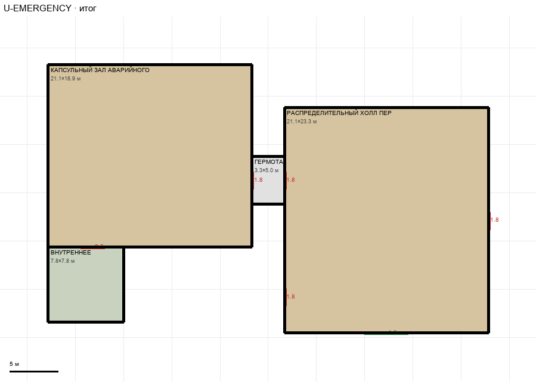

# U-EMERGENCY

Этаж: верхний (LV-U). Источник: `docs/design/complex_v3/plans/sectors/upper/u_emergency.svg`. Высота стен 3.8 м. Габарит 45.6×27.8 м, x -107.8…-62.2, z -8.2…19.6.

## Помещения

| Помещение | Размер, м | м² | Класс |
|---|---|---|---|
| КАПСУЛЬНЫЙ ЗАЛ АВАРИЙНОГО БЛОКА | 21.11×18.89 | 398.8 | personnel |
| ВНУТРЕННЕЕ | 7.78×7.78 | 60.5 | support |
| ГЕРМОТАМБУР | 3.33×4.96 | 16.5 | corridor |
| РАСПРЕДЕЛИТЕЛЬНЫЙ ХОЛЛ ПЕРСОНАЛА | 21.11×23.33 | 492.6 | personnel |

## Проёмы и двери

door 1.8 м × 4, door 2.52 м × 1, opening 4.5 м × 1

## Решения

- **D-01** — Гермотамбур остаётся шлюзом, оба проёма — гермодвери 1,8×2,8 м
- **D-02** — Двери хола в смежные помещения одинаковы: 1,8×2,8 м (тамбур, боковой проход к медотсеку, маршрут A)
- **D-03** — Добавлен широкий проход хол → главный коридор 4,5 м без двери
- **D-11** — Вариант B: процедурная и палата шире на 1,1 м; промежуток между медотсеком и холлом убран, приёмная примыкает к холлу, общая дверь 1,8 м; полоса «вход» и окно удалены; двери комнат — служебные 1,0×2,1

## Автонаблюдения

- opening_not_on_sector_wall u_emergency-opening-005
- opening_not_on_sector_wall u_emergency-opening-006
- opening_not_on_sector_wall u_emergency-opening-008

