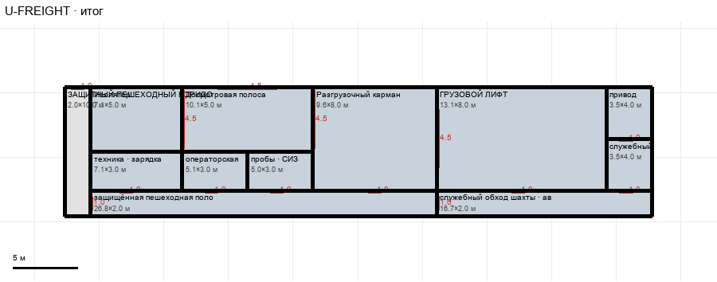

# U-FREIGHT

Этаж: верхний (LV-U). Источник: `docs/design/complex_v3/plans/sectors/upper/u_freight.svg`. Высота стен 5.0 м. Габарит 45.4×10.0 м, x -17.7…27.8, z 69.6…79.6.

## Помещения

| Помещение | Размер, м | м² | Класс |
|---|---|---|---|
| Изолятор | 7.07×5.00 | 35.4 | controlled |
| техника · зарядка | 7.07×3.00 | 21.2 | work |
| Досмотровая полоса | 10.10×5.00 | 50.5 | work |
| операторская | 5.05×3.00 | 15.2 | controlled |
| пробы · СИЗ | 5.05×3.00 | 15.1 | controlled |
| Разгрузочный карман | 9.60×8.00 | 76.8 | work |
| защищённая пешеходная полоса · 1,8–2 м | 26.77×2.00 | 53.5 | walkway |
| ГРУЗОВОЙ ЛИФТ | 13.13×8.00 | 105.0 | lift |
| привод | 3.54×4.00 | 14.1 | controlled |
| служебный | 3.54×4.00 | 14.1 | controlled |
| служебный обход шахты · аварийная связь | 16.67×2.00 | 33.3 | walkway |
| ЗАЩИТНЫЙ ПЕШЕХОДНЫЙ КОРИДОР | 2.00×10.00 | 20.0 | corridor |

## Проёмы и двери

door 1.0 м × 4, door 1.01 м × 6, door 4.5 м × 4

## Решения

- **D-19** — Ворота тракта 4,5×4,5 м в пределах помещений (изолятор тоже), дверь обход шахты ↔ пешеходная полоса, защитный коридор слева (вариант A) с дверью в магистраль, проём шахты лифта; G-02 вариант A: нижний грузовой блок +5,6 м к югу под верхний

## Автонаблюдения

- opening_not_on_sector_wall u_freight-annotation-003

