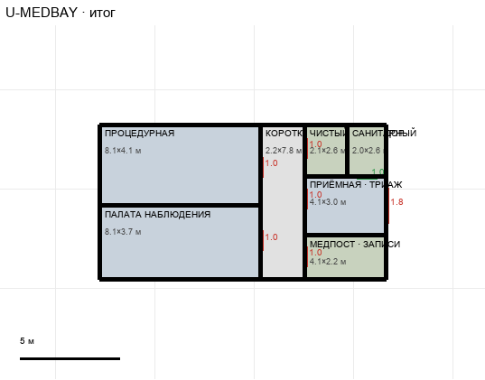

# U-MEDBAY

Этаж: верхний (LV-U). Источник: `docs/design/complex_v4/sources/plans/sectors/upper/u_medbay.svg`. Высота стен 5.0 м. Габарит 14.4×7.8 м, x -97.8…-83.3, z 11.8…19.5.

## Помещения

| Помещение | Размер, м | м² | Класс |
|---|---|---|---|
| ПРОЦЕДУРНАЯ | 8.13×4.09 | 33.2 | medical |
| ПАЛАТА НАБЛЮДЕНИЯ | 8.13×3.69 | 30.0 | medical |
| КОРОТКИЙ ЧИСТЫЙ КОРИДОР · 2,2 М | 2.22×7.78 | 17.3 | corridor |
| ЧИСТЫЙ | 2.10×2.59 | 5.5 | support |
| САНИТАРНЫЙ | 1.99×2.59 | 5.2 | support |
| ПРИЁМНАЯ · ТРИАЖ | 4.09×2.99 | 12.2 | medical |
| МЕДПОСТ · ЗАПИСИ | 4.09×2.19 | 9.0 | support |

## Проёмы и двери

door 1.0 м × 5, door 1.8 м × 1, opening 1.0 м × 1

## Решения

- **D-04** — Медотсек сдвинут на 1,1 м к коридору: общей стены с капсульным залом нет
- **D-11** — Вариант B: процедурная и палата шире на 1,1 м; промежуток между медотсеком и холлом убран, приёмная примыкает к холлу, общая дверь 1,8 м; полоса «вход» и окно удалены; двери комнат — служебные 1,0×2,1

