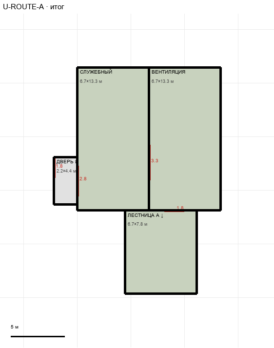

# U-ROUTE-A

Этаж: верхний (LV-U). Источник: `docs/design/complex_v4/sources/plans/sectors/upper/u_emergency.svg`. Высота стен 5.0 м. Габарит 15.6×21.1 м, x -62.2…-46.7, z -1.5…19.6.

## Помещения

| Помещение | Размер, м | м² | Класс |
|---|---|---|---|
| ДВЕРЬ ИЗ ХОЛЛА | 2.22×4.44 | 9.9 | corridor |
| СЛУЖЕБНЫЙ | 6.67×13.33 | 88.9 | support |
| ВЕНТИЛЯЦИЯ | 6.67×13.33 | 88.9 | support |
| ЛЕСТНИЦА A ↓ | 6.67×7.78 | 51.8 | support |

## Проёмы и двери

door 1.8 м × 2, door 2.81 м × 1, door 3.26 м × 1

## Решения

- **D-06** — Проём лестницы H1: вся комната 6,7×7,8 м на обоих этажах; двери лестницы 1,8 м

## Автонаблюдения

- opening_not_on_sector_wall u_emergency-opening-010
- opening_not_on_sector_wall u_emergency-annotation-001
- opening_not_on_sector_wall u_emergency-annotation-002
- opening_not_on_sector_wall u_emergency-annotation-003

