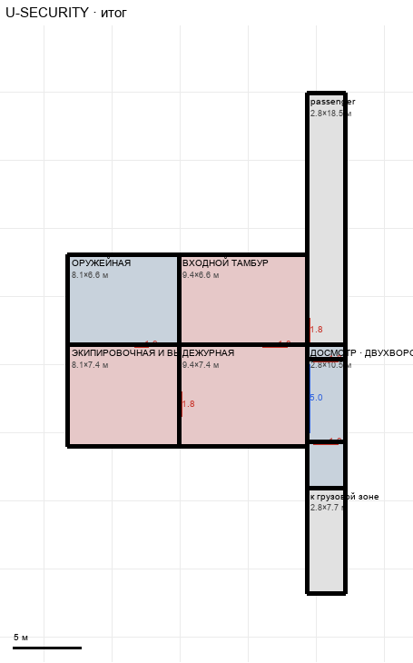

# U-SECURITY

Этаж: верхний (LV-U). Источник: `docs/design/complex_v3/plans/sectors/upper/u_security.svg`. Высота стен 3.4 м. Габарит 20.4×36.7 м, x -28.2…-7.9, z 25.1…61.8.

## Помещения

| Помещение | Размер, м | м² | Класс |
|---|---|---|---|
| passenger | 2.81×18.47 | 51.9 | passenger |
| ОРУЖЕЙНАЯ | 8.15×6.60 | 53.8 | store |
| ВХОДНОЙ ТАМБУР | 9.41×6.60 | 62.1 | security |
| ЭКИПИРОВОЧНАЯ И ВЫДАЧА | 8.15×7.44 | 60.6 | security |
| ДЕЖУРНАЯ | 9.41×7.44 | 70.0 | security |
| ДОСМОТР · ДВУХВОРОТНЫЙ КПП | 2.81×10.51 | 29.5 | checkpoint |
| к грузовой зоне | 2.81×7.71 | 21.6 | passenger |

## Проёмы и двери

door 1.0 м × 1, door 1.8 м × 5, window 5.0 м × 1

## Решения

- **D-18** — Принято: связь и КПП вплотную к блоку, два ворота 1,8 на КПП (поперечные стены), окно дежурной на КПП 5 м, двери блока 1,8 / 1,0, вход в тамбур 1,8
- **D-20** — Связь безопасности продлена до главного коридора (север) и до тяжёлой магистрали (юг)

## Автонаблюдения

- opening_not_on_sector_wall u_security-opening-011
- opening_not_on_sector_wall u_security-annotation-005
- opening_not_on_sector_wall u_security-annotation-006

